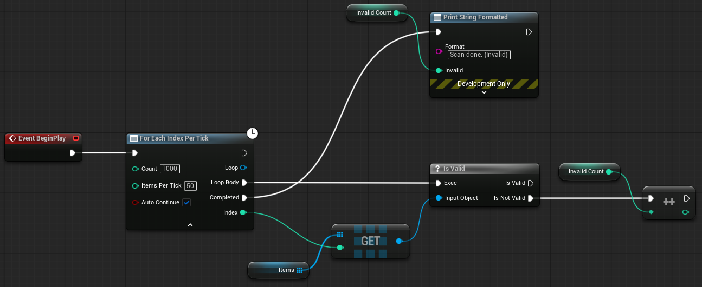
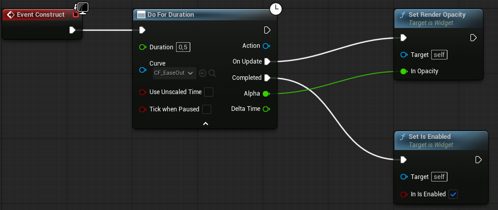

# Recipes

*Staggered spawning, a per-frame scan, a curve-driven fade, a pause-menu animation, waiting for an actor with a timeout, an actor that owns its console commands.*

Each recipe is a Blueprint graph described as steps, with the pins that matter. Three were built
in the editor and show that graph: the thousand-item scan, the fade-in and the boss wait. The
others are written from the reference and have not been built as shown, and the C++ snippet at
the end is not compiled.

## Spawn ten enemies, one every quarter second

1. From `Event BeginPlay`: **For Each Index With Delay** — `Count` = `10`, `Delay` = `0.25`.
2. From `Loop Body`: **Spawn Actor from Class**, with the transform computed from `Index` (a
   `Make Transform` with `Index × 200` on X, for example).
3. From `Completed`: whatever should happen once all ten exist — enable the encounter, play a
   sound.

`Auto Continue` stays checked: spawning is synchronous, so the body is done when it returns.
`Completed` fires right after the tenth spawn — [there is no delay after the last
iteration](../reference/for-each-index.md#for-each-index-with-delay).

**To wait until each enemy has finished its intro animation before spawning the next**, clear
`Auto Continue`, and from the end of the intro (a `Play Montage`'s `On Completed`, for instance)
call `Continue Loop` on the loop's `Loop` pin. Promote the `Loop` pin to a variable so the
montage's completion event can reach it.

## Scan a thousand items without a hitch

1. **For Each Index Per Tick** — `Count` = `1000`, `Items Per Tick` = `50`.
2. From `Loop Body`: the per-item check, using `Index` to look the item up.
3. From `Completed`: use the results.



*Scanning a thousand items: **For Each Index Per Tick** with `Count` = `1000` and
`Items Per Tick` = `50`, the per-item check in `Loop Body`, the results in `Completed`.*

The scan takes twenty frames at fifty checks each, so no single frame pays for a thousand. If
fifty checks still stall a frame, lower `Items Per Tick`; if a check is cheap, raise it — there is
no upper bound.

A body that is latent — an asset load per item, for example — needs `Auto Continue` cleared and a
`Continue Loop` when the load finishes, and then [runs one item per frame regardless of
`Items Per Tick`](../reference/for-each-index.md#for-each-index-per-tick).

## Fade a widget in on an ease-out curve

1. Create a **Curve Float** asset; put a key at `(0, 0)` and one at `(1, 1)`, and set the second
   key's tangent so the curve arrives flat.
2. **Do For Duration** — `Duration` = `0.5`, `Curve` = the asset.
3. From `On Update`: **Set Render Opacity** on the widget with `Alpha`.
4. From `Completed`: enable input on the widget.



*Fading a widget in: **Do For Duration** with `Duration` = `0.5` and an ease-out curve on `Curve`;
`On Update` sets Render Opacity to `Alpha`, and `Completed` enables the widget.*

[The last `On Update` carries the curve's value at time
`1`](../reference/do-for-duration.md#the-final-frame-guarantee) — here `1.0` — so the widget ends
fully opaque, not at `0.97`. Without the curve the alpha is linear and still ends at exactly `1`.

**To fade out**, drive the same node and feed `1 − Alpha` into opacity; or author a curve from
`(0, 1)` to `(1, 0)`.

## Animate a pause menu while the game is paused

1. **Do For Duration** — `Duration` = `0.3`; under the advanced arrow, check **`Tick When
   Paused`**.
2. From `On Update`: the menu's slide-in — a `Set Render Translation` with a lerp on `Alpha`.
3. Start the node, then call **Set Game Paused** (`true`); the drive keeps running through the
   pause.

Without `Tick When Paused` the drive freezes the moment the game pauses and the menu stops
mid-slide. `Use Unscaled Time` is [a separate question, about which clock the drive
integrates](../concepts/flow-family.md#two-clocks) — leave it off unless the game also uses time
dilation and you want the menu unaffected by it.

## Wait for the boss to exist, but not forever

1. Create a Blueprint **function** `IsBossPresent` ([why `Condition` takes a function, not an
   event](../reference/wait-until.md#binding-condition)), input `Attempt` (Integer), output
   `Present` (Boolean). Its body: **Get Actor of Class** (the boss class) → **Is Valid** →
   return.
2. On the event graph: **Wait Until** — `Poll Interval` = `0.5`, `Timeout` = `10.0`, `Check
   Immediately` checked.
3. Drag from `Condition`, choose **Create Event**, pick `IsBossPresent`.
4. From `On Satisfied`: start the fight. From `On Timed Out`: log the failure and fall back.
   `On Cancelled` can stay unconnected if nothing calls `Cancel`.


*The `IsBossPresent` function: input `Attempt` (Integer), output `Present` (Boolean), with
**Get Actor of Class** and **Is Valid** inside.*


*The recipe's event graph: **Wait Until** with `Poll Interval` = `0.5`, `Timeout` = `10` and
`Check Immediately`, `Condition` bound through **Create Event** to `IsBossPresent`.*

`Check Immediately` means a boss that is already there fires `On Satisfied` in the same frame.
With `Poll Interval` at `0.5` and `Timeout` at `10`, the condition is asked once at activation
and then up to nineteen more times. With `Poll Interval` at `10` or more,
[the deadline lands before the first poll is due](../reference/wait-until.md#the-deadline-and-the-poll):
it would be asked only once, at activation, before the node times out.

Keep the function on a Blueprint that outlives the wait. If the object owning `IsBossPresent` is
destroyed mid-wait, [the node fires `On Timed Out` and logs an
`Error`](../reference/wait-until.md#outputs).

## An actor that owns its own console commands

1. In the actor's `BeginPlay`: **Get Console Command Registry** → **Register Console Command**
   with `Name` = `MyGame.Debug.KillMe`, `Help` = `Destroys this actor`, and `Callback` bound to a
   custom event on the actor with one `Args` (Array of String) pin.
2. In the custom event: **Destroy Actor**.
3. In `EndPlay`: **Get Console Command Registry** → **Unregister Commands For** with `Owner` =
   `self`.

[The registry holds the actor
weakly](../reference/console-commands.md#registerconsolecommandname-help-callback), so a forgotten
`EndPlay` half of the pair is not a crash — the command does nothing once the actor is gone, and
the registry sweeps it out at the next registration. `Unregister Commands For` is still the right
thing to do: it removes the console entry the moment the actor leaves, instead of leaving a dead
name listed until something else registers.

**Two actors of the same class** register the same name; the second one's registration returns
`false`. Put the actor's name into the command name (`MyGame.Debug.Kill.<Name>`), or register the
command once from the registry's Blueprint child and have it find the actor by argument.

**From C++**, the same recipe binds a `UFUNCTION` with the signature
`void HandleCommand(const TArray<FString>& Args)`:

```cpp
FSCBlueprintConsoleCommand Callback;
Callback.BindDynamic(this, &AMyActor::HandleCommand);
if (USCConsoleCommandRegistrySubsystem* Registry = USCConsoleCommandRegistrySubsystem::Resolve(this))
{
	Registry->RegisterConsoleCommand(TEXT("MyGame.Debug.KillMe"), TEXT("Destroys this actor"), Callback);
}
// in EndPlay:
if (USCConsoleCommandRegistrySubsystem* Registry = USCConsoleCommandRegistrySubsystem::Resolve(this))
{
	Registry->UnregisterCommandsFor(this);
}
```

---

← [Advanced](README.md) · [Documentation index](../../README.md#documentation)
