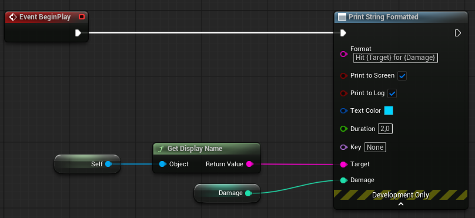

# Print String Formatted

*The graph node — argument pins from braces, accepted types, the option pins, the number-formatting caveat, and why there is no C++ side.*

## `UK2Node_SCPrintStringFormatted`

*Available in: Blueprint.* A `UK2Node`, module `StillCookingCoreEditor`. Blueprint node
`Print String Formatted`. Category `StillCooking|Debug`. **Development Only.**

A `Print String` whose argument pins come from the string itself. Type `Index {Index}` into
`Format` and the node grows an input pin called `Index`; delete the closing brace and the pin
goes away. At compile time the node expands into the engine's `Format Text`, a text-to-string
conversion and `Print String`, so at runtime there is nothing of the plugin left in the graph.

## No C++ side

There is no C++ side to this node and nothing to call. A C++ caller who wants formatted output
uses `FString::Printf` or `FText::Format` directly. There is no `Print Text Formatted` either:
the expansion above already ends in `Print String`, so a text variant would be a different node
with a different sink.

## Format and argument pins

| Pin | Meaning |
| --- | --- |
| `Format` | a String literal; every `{Name}` in it produces one input pin called `Name` |

***Print String Formatted** with `Format` = `Hit {Target} for {Damage}`: the node has grown two
argument pins, `Target` and `Damage`, in order of first appearance; the option pins are expanded.*

Rules for the braces:

- **Pins appear in order of first appearance** in the literal, not alphabetically.
- **Numeric names work**: `{0}-{1}` produces pins `0` and `1`.
- **Case variants collapse into one pin.** `{Name}` and `{name}` produce a single pin, named
  after the first occurrence. Only that first occurrence receives the argument; the other brace
  prints as nothing. The cause is that graph pin names are case-insensitive; the engine's
  `Format Text` behaves the same way.
- **An empty `{}`, an unclosed `{Index` or a stray `Index}`** reference no argument, so no pin
  appears until the brace closes.
- **An unwired pin prints as nothing** — neither the value nor the brace.

An argument pin is a wildcard until something is connected to it, then takes the type of its
connection, and reverts to a wildcard when disconnected. Accepted types: Byte, Integer, Int64,
Float, Double, Text, String, Name, Boolean, Object and `ETextGender` — the same set the
engine's `Format Text` accepts.

## Option pins

Under the advanced arrow, with the defaults of the engine's `Print String`:

| Pin | Default | Meaning |
| --- | --- | --- |
| `Print To Screen` | `true` | show the line on screen |
| `Print To Log` | `true` | write the line to the log |
| `Text Color` | (R 0.0, G 0.66, B 1.0) | on-screen colour; connectable |
| `Duration` | `2.0` | seconds on screen |
| `Key` | `None` | a key to replace an earlier line with the same key |

These pins are not argument pins and survive any edit to `Format`.

## Numbers and culture

**Numeric arguments are formatted by the current culture.** The expansion goes through
`Format Text`, which groups digits the way the machine's locale does: `1234` on an Integer pin
prints `1 234` under a Polish culture and `1,234` under an English one.

Treat the grouping as unstable and do not parse the output: a later version will move to
culture-independent formatting, which will change it.

## Shipping, Test, and reload

**The node is [compiled out of Shipping and Test builds](../concepts/builds-and-shipping.md#what-is-gone-in-shipping).**
Nothing else in the graph changes.

**Reload.** Blueprints are reconstructed node by node on load, which rebuilds the argument pins
from scratch; the node then re-derives each argument pin's type from its connection. Before
0.7.1 it did not — see [Common problems](../troubleshooting/common-problems.md).

## Pitfalls

- **Do not parse the printed numbers** — see above.
- **A missing pin after typing a brace** means the brace is not closed yet, or you typed a case
  variant of a name that already has a pin.
- **The node, and any output that depended on it, is not in a Shipping or Test build** — see above.
- **Renaming the node's class or its serialized pin-name property** in a fork orphans the node
  in every Blueprint that already uses it.

---

← [Reference](README.md) · [Documentation index](../../README.md#documentation)
