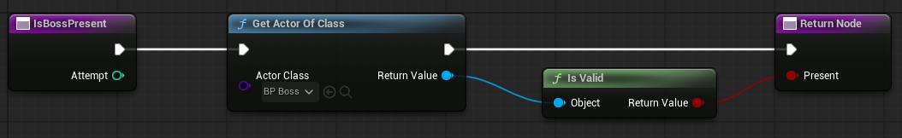
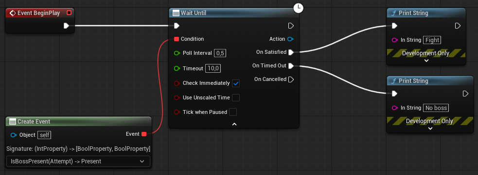

# Wait Until

***Wait Until** — the condition function, poll interval, timeout, the three exec outputs, and the binding rule that fails at compile time.*

## `USCFlowWaitUntil`

*Available in: C++ and Blueprint.* `UBlueprintAsyncActionBase`, `BlueprintType`, proxy pin
`Action`. Module `StillCookingCore`, header `Flow/SCFlowWaitUntil.h`. Category
`StillCooking|Flow`. Built on `FSCFlowConditionPoll`. **[Placeable on an event graph
only](../concepts/flow-family.md#where-a-flow-node-can-go)**, not inside a function graph, like every
Flow node.

Polls `Condition` every `Poll Interval` seconds until it returns `true`, then fires
`On Satisfied`. Gives up on `Timeout` with `On Timed Out`, or on `Cancel` with `On Cancelled`.

### `WaitUntil(...)`

- **C++ call** — `USCFlowWaitUntil::WaitUntil(WorldContextObject, Condition, PollInterval, Timeout, bCheckImmediately, bUseUnscaledTime, bTickWhenPaused)`, then `Activate()`
- **Blueprint node** — `Wait Until`

| Parameter | Pin | Default | Meaning |
| --- | --- | --- | --- |
| `WorldContextObject` | hidden | — | filled in by `self` |
| `Condition` | `Condition` | — | an `FSCFlowConditionSignature` delegate: `(int32 Attempt) -> bool`; see below |
| `PollInterval` | `Poll Interval` | `0.1` | seconds between polls; `0` or less polls every tick |
| `Timeout` | `Timeout` | `0.0` | seconds until `On Timed Out`; `0` or less waits without a deadline |
| `bCheckImmediately` | `Check Immediately` | `false` | poll once during activation, before the first tick |
| `bUseUnscaledTime` | `Use Unscaled Time` | `false` | advanced; integrate real time instead of the world's dilated time. [Independent of `Tick When Paused`](../concepts/flow-family.md#two-clocks) |
| `bTickWhenPaused` | `Tick When Paused` | `false` | advanced; keep polling — and keep the deadline advancing — while the game is paused |

`Attempt` is zero-based and increases by one per poll. The poll clock carries its sub-interval
remainder, so the interval is honoured on average across uneven frames.

## Binding `Condition`

`Condition` has to return a value, and in Blueprint only a **function** can. Bind it through
**Create Event** to a Blueprint function with the signature `(int32 Attempt) -> bool`:

1. In the Blueprint's **Functions** list, create a function. Give it one input, `Attempt`
   (Integer), and one output, a Boolean.
2. On the **Wait Until** node, drag from the `Condition` pin and choose **Create Event**.
3. In the drop-down on the new node, pick the function.



*The condition is a function, not an event: `IsBossPresent` takes `Attempt` (Integer) and returns
`Present` (Boolean) — **Get Actor of Class**, then **Is Valid**.*



***Wait Until** with `Poll Interval` = `0.5`, `Timeout` = `10` and `Check Immediately` checked. The
`Condition` pin is bound through **Create Event** to the `IsBossPresent` function; `On Satisfied`
and `On Timed Out` lead to two different branches.*

A **custom event** connects to the pin without protest and then fails at compile time, because
an event cannot declare a return value. The compiler reports:

```
Create Event Signature Error: The function/event '<name>' does not match the necessary signature - has the delegate or function/event changed?
```

Only compilation reports an invalid binding; the node cannot tell you while you edit.

## The deadline and the poll

Each tick, the node does three things in this order:

1. **Adds the delta to the elapsed time and tests the deadline.** If `Timeout` is positive and
   elapsed has reached it (`>=`, not `>`), the node finishes with `On Timed Out` — *before*
   polling. A condition that would have answered `true` on exactly the frame the deadline lands
   does not win.
2. **Checks the no-deadline warning** (below).
3. **Polls**, if the poll interval has elapsed.

Two consequences. If `Poll Interval` is at least `Timeout`, the deadline lands before the first
poll is due: without `Check Immediately` the condition is never asked, and with it the condition
is asked once, at activation — either way the node then reports `On Timed Out`. And a `Timeout`
of `0` is not a short deadline; it is *no* deadline.

`Check Immediately` polls once during activation, so a condition that is already `true` fires
`On Satisfied` in the same frame the node activates. Without it, [the first poll happens on a
tick](../concepts/flow-family.md#two-timing-rules), once `Poll Interval` seconds have accumulated;
with `Poll Interval` at `0` or less, on the first tick.

## Functions

### `Cancel()`

*Available in: C++ and Blueprint.*

- **C++ call** — `Node->Cancel()`
- **Blueprint node** — `Cancel`, on the `Action` pin

Ends the wait early; `On Cancelled` fires once and polling stops. Issued from outside the
condition function, `On Cancelled` fires before `Cancel` returns. A `Cancel` issued from inside
the condition function is deferred until the function returns, so this is safe from the
condition itself.

## Outputs

| Pin / delegate | Type | When |
| --- | --- | --- |
| `On Satisfied` (`OnSatisfied`) | `FSCFlowSignalSignature()` | `Condition` returned `true` |
| `On Timed Out` (`OnTimedOut`) | `FSCFlowSignalSignature()` | `Timeout` elapsed — **and** when `Condition` is or becomes uncallable (below) |
| `On Cancelled` (`OnCancelled`) | `FSCFlowSignalSignature()` | `Cancel` ended the wait |
| `Action` | `USCFlowWaitUntil*` | the node itself, for `Cancel` — [the proxy pin every Flow node carries](../concepts/flow-family.md#the-proxy-pin) |

Exactly one of the three fires, once; [none fires when the world is torn
down](../concepts/flow-family.md#how-a-task-ends).

**An unbound or lost `Condition` takes `On Timed Out`.** The delegate holds a *weak* reference to
its target. If the pin was never bound, or the object it was bound to is destroyed mid-wait, the
condition can no longer be called, and the wait ends as a timeout. The node logs an `Error` and
fires `On Timed Out`, not `On Cancelled`, since the caller did not cancel anything. An unbound
pin fires `On Timed Out` during activation, before any tick.

## Messages

Three, all on `LogStillCooking`. The exact wording of
[this node's two messages](../troubleshooting/diagnostics.md#wait-until) and of
[the message every Flow node can write](../troubleshooting/diagnostics.md#flow-all-nodes):

| When | Level |
| --- | --- |
| `Condition` is unbound at activation, or is lost mid-wait | Error |
| `Timeout` is `0` or less and the wait runs past the threshold | Warning, once per node |
| the world context resolved no world, so nothing fires and the condition is never asked | Error |

The threshold is the console variable `SC.Flow.WaitUntilWarningSeconds`; `0` or less disables the
warning — [why it is a variable and not a
pin](../concepts/flow-family.md#warnings-instead-of-silence). A wait *with* a deadline never
warns.

## Pitfalls

- **Custom event on `Condition`** — compiles no further. Use a function.
- **`Poll Interval` ≥ `Timeout`** — times out without asking on any tick (only the
  `Check Immediately` poll, if set, happens).
- **Destroying the actor that owns the condition function** while the wait runs ends it through
  `On Timed Out`, with the `Error` above in the log.
- **[A second `Activate()` is ignored](../concepts/flow-family.md#two-timing-rules).** One node,
  one wait; call `Wait Until` again for another.

---

← [Reference](README.md) · [Documentation index](../../README.md#documentation)
