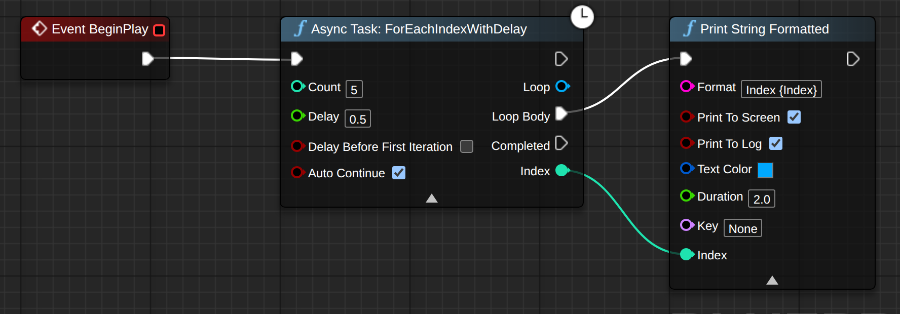

# Quick start

*From a fresh clone to five lines printing half a second apart — one loop node, one print node, no C++.*

## What you need

- Unreal Engine **5.7** or **5.8**, Win64 — the only combinations
  [built and tested](../project/compatibility.md).
- **A C++ project** — [the plugin is compiled with your project](installation.md), and a single
  empty C++ class is enough to qualify.
- **Visual Studio 2022** with the *Game development with C++* workload.
- Git, to clone the repository. Other ways to get the source: [Installation](installation.md).

## Install

From the root of your project:

```
git clone https://github.com/StillCooking/StillCooking_Tools.git Plugins/StillCooking_Tools
```

Regenerate the project files (right-click the `.uproject` → **Generate Visual Studio project
files**), build in **Development Editor**, and open the editor. Nothing else is needed: a plugin in
`Plugins/` is [enabled without an entry in your `.uproject`](installation.md).

Full instructions, including the `Build.cs` line for C++ callers: [Installation](installation.md).

## Your first graph

1. Open any actor Blueprint — the level's Game Mode, a fresh actor placed in the level, anything
   with an **Event Graph**.
2. From `Event BeginPlay`, place **For Each Index With Delay**. Set `Count` = `5` and `Delay` =
   `0.5`. Leave the advanced pins at their defaults; `Auto Continue` stays checked.
3. From the node's `Loop Body` exec pin, place **Print String Formatted** (in the palette under
   `StillCooking|Debug`).
4. Type `Index {Index}` into its `Format` pin. The moment the closing brace lands, an input pin
   named `Index` appears on the node.
5. Wire the loop's `Index` output pin into the print node's new `Index` pin. Compile, save, press
   Play.



*`Event BeginPlay` starts **For Each Index With Delay** with `Count` = `5` and `Delay` = `0.5`.
`Loop Body` leads to **Print String Formatted** with `Format` = `Index {Index}`, and the loop's
`Index` pin is wired into the print node's `Index` pin.*

Five lines print on screen and in the Output Log, one every half second:

```
Index 0
Index 1
Index 2
Index 3
Index 4
```

## How you know it works

**`Completed` fires once, after the last line.** From the loop's `Completed` exec pin, place a
second **Print String Formatted** with `Format` = `Done`. It prints `Done` after `Index 4`. The
node has no pin that says whether the loop ran to the end or `Break Loop` stopped it —
[why, and how to tell the two apart](../concepts/flow-family.md#completed-without-a-reason).

**The lines are half a second apart.** If the five lines appear together, one per frame, the
`Delay` pin is `0`, which is legal and means "one iteration per tick".

## What next

- [The Flow family](../concepts/flow-family.md) — the shape all four Flow nodes share: the proxy
  pin, `Completed`, cancellation, and the two clock options.
- [For Each Index](../reference/for-each-index.md) — every pin on the loop node, including the
  latent-body protocol and the per-tick variant.
- [Print String Formatted](../reference/print-string-formatted.md) — which types the argument pins
  accept, and why you should not parse numbers from its output.
- [Common problems](../troubleshooting/common-problems.md) — when a loop in your own graph runs
  once and stops.

---

← [Start here](README.md) · [Documentation index](../../README.md#documentation)
